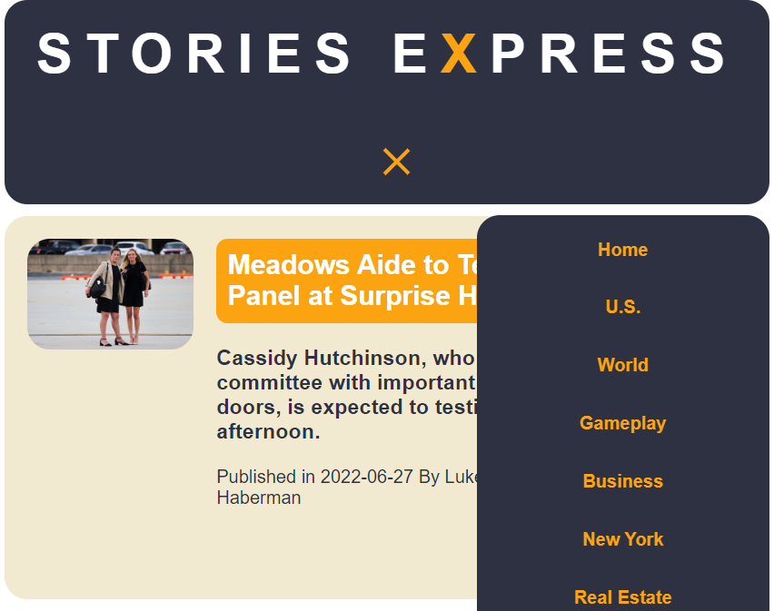
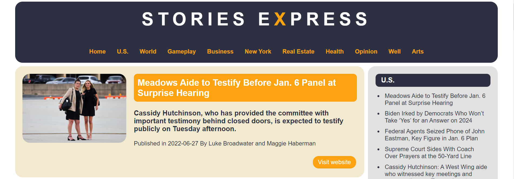

# [STORIES EXPRESS APP](https://stories-express.netlify.app/)




#### STORIES EXPRESS is a news app that shows you the most viewed news using NewYorkTimes most viewed API.

#### You can try the app from an online deployed version [HERE!](https://stories-express.netlify.app/)

#### What does the app offer ?

- You can preview the most viewed articles in New York Times today!.
- A navigation bar with categories section that is up to date with the most viewed news.
- Filter the news based on what category you choose.
- News card that shows you the details of each article, title, description, date of publish and publisher.
- News list filtered based on category to fast show you the titles only of the most viewed news.
- Access to the original website when you click on visit website, and when you click on the news title in news listed by category.

### Folder structure:

```
|-- Assets
|-- Components
|   |-- NavBar
|   |   |-- NavBarCategory.js
|   |   |-- Navbar.css
|   |   |-- Navbar.js
|   |   `-- NavbarButton.js
|   |-- NewsCard
|   |   |-- NewsCard.css
|   |   |-- NewsCard.js
|   |   |-- NewsCardList.js
|   |   `-- NewsCardListCategory.js
|   `-- NewsTitle
|       |-- NewsTitleCard.css
|       |-- NewsTitleCard.js
|       `-- NewsTitleList.js
|-- Context
|   `-- NewsContext.js
|-- Helpers
|   `-- keyExistCheck.js
|-- Hooks
|   `-- useFetch.js
|-- Pages
|   |-- CategoryPage.css
|   |-- CategoryPage.js
|   |-- HomePage.css
|   `-- HomePage.js
`-- index.js
```

### Getting Started:

to get started clone the repository, instal dependencies and run app

| Steps   | with [NPM](https://www.npmjs.com/) |
| ------- | ---------------------------------- |
| Install | `npm install`                      |
| Run     | `npm start`                        |
